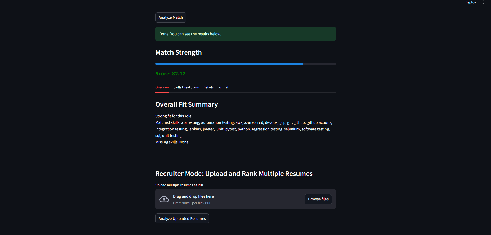
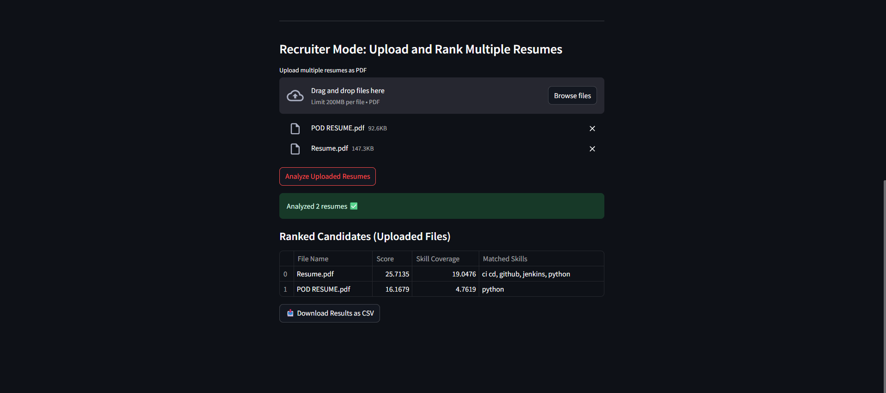

# FitScore -  AI Resume–JD Match Analyzer

FitScore AI is an AI-powered Applicant Screening System that evaluates how well a resume matches a job description using Machine Learning, NLP, and semantic similarity models.
The system identifies matched & missing skills, computes a Fit Score (0–100), evaluates resume formatting, and can also rank multiple candidates for recruiters.

## • Key Features

| Feature | Description |
|--------|-------------|
| 1. Resume–JD Fit Score | Uses TF-IDF + SentenceTransformer cosine similarity |
| 2. Skill Extraction | Extracts key skills from both JD & resume |
| 3. Insight Report | Matched vs Missing skills for improvement |
| 4. Resume Format Score | Summary, experience, projects, skills, education, length, bullet usage |
| 5. PDF Support | Upload PDF resume → automatic text extraction |
| 6. Recruiter Mode | Upload multiple resumes → ranked leaderboard |
| 7. Export | Download candidate ranking as CSV |
| 8. Modern UI | Interactive Streamlit frontend |

## • Tech Stack

| Area | Technology |
|------|-------------|
| UI | Streamlit |
| ML / NLP | TF-IDF, SentenceTransformer (all-MiniLM-L6-v2) |
| PDF Parsing | PyPDF2 |
| Backend | Python |
| Environment | Offline / No API required |

## System Architecture
```
Resume / JD Input (Text / PDF)
                ↓
         Text Extraction
                ↓
      NLP Cleaning & Tokenization
                ↓
 TF-IDF Similarity + Sentence Embedding Similarity
                ↓
      Base Similarity Score (0–100)
                ↓
  Skill Extraction (Hardcoded KB + Synonyms)
                ↓
Matched Skills + Missing Skills + Skill Coverage %
                ↓
 Resume Format Score + Final FitScore
                ↓
 Final Report / Multi-Resume Ranking
```

## Project Structure
```
Project/
│
├── app/
│   └── streamlit_app.py  # Streamlit UI
│
├── src/
│   └── ats_engine.py #Core ML/NLP engine
│
└── notebooks/
    └── 01_baseline_similarity.ipynb  # Experiment notebook

```


---

## Screenshots 

```md
### 🔹 HomePage


### 🔹 Fit Score Report


### 🔹 Multi-Resume Leaderboard (Recruiter Mode)

